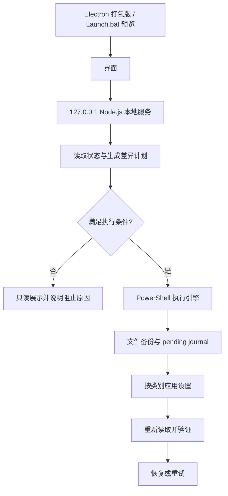

<div align="center">

# Win11 Optimizer

**读取当前状态、规划目标差异，并保留可恢复记录的 Windows 11 游戏优化工具。**

[快速开始](#快速开始) · [功能范围](#功能范围) · [安全与恢复](#安全与恢复) ·
[开发与构建](#开发与构建) · [许可证](#许可证)

[](https://github.com/AkiraNyx/Win11-Gaming-Optimizer/actions/workflows/build-exe.yml)

</div>

---

Win11 Optimizer 是一个由 Electron 桌面界面、Node.js 本地服务和 PowerShell 执行引擎组成的 Windows 11 优化工具。它先读取当前硬件与系统状态，再将目标配置转换为差异计划；只有可验证的差异才会进入执行流程，并在执行前创建备份、写入恢复记录，执行后重新读取并验证结果。

项目关注的是**可观测、可控、可恢复**，而不是承诺固定的 FPS、延迟或帧时间收益。实际效果取决于硬件、驱动、系统版本与具体游戏。

> 当前开发版本：[Dev 0.0.3](https://github.com/AkiraNyx/Win11-Gaming-Optimizer/releases/tag/v0.0.3) · 配置 Schema：`2.0`

<p align="center">
  
</p>

> [!WARNING]
> 只有 Windows 11 客户端上的打包版、管理员权限和受保护的运行时目录同时满足条件时，才会启用系统修改、恢复与卸载。`Launch.bat` 仅用于源码预览，会永久禁用系统修改。

## 核心功能

- **状态读取**：检查 Windows 版本、管理员权限、运行时完整性、硬件条件以及 84 个配置项的当前状态。
- **目标预设**：提供保守、平衡、极致和自定义目标；“当前”表示实时状态，不是独立预设。
- **差异计划**：执行前展示待处理项、依赖关系、硬件限制与不可验证状态。
- **分步执行**：按类别应用设置，每次操作前重新读取目标，执行后验证实际结果。
- **恢复记录**：保存文件备份、变更清单和待处理 journal，支持重试未完成的恢复。
- **硬件感知**：检测打印机、蓝牙和内存容量等条件，避免应用不适合当前机器的目标。

## 环境要求

| 场景 | 要求 | 说明 |
| --- | --- | --- |
| 使用发布版 | Windows 11 客户端（Build 22000+）、x64、Windows PowerShell 5.1、管理员权限 | Windows Server 不在支持范围内；打包版为需要管理员权限的 portable EXE |
| 源码预览 | Windows、Node.js 22、npm | 仓库构建工作流使用 Node.js 22；预览只读取状态并展示界面，不修改系统 |
| 本地构建 | Windows、Node.js 22、npm、Windows PowerShell 5.1 | `Build.bat` 会执行 UI 构建、Node/Electron 测试、ESLint、TypeScript 检查和打包 |

## 快速开始

### 使用发布版

1. 打开 [GitHub Releases](https://github.com/AkiraNyx/Win11-Gaming-Optimizer/releases)，下载 `Win11Optimizer.exe`。
2. 运行程序并在 UAC 提示中允许管理员权限。
3. 等待状态读取完成，选择保守、平衡、极致或自定义目标。
4. 检查差异计划、风险提示和备份说明。
5. 确认后执行；执行完成后等待程序重新读取并验证状态。

### 只读预览源码

源码预览不会修改系统设置，适合查看界面、状态读取和目标差异计算：

```powershell
git clone https://github.com/AkiraNyx/Win11-Gaming-Optimizer.git
cd .\Win11-Gaming-Optimizer
.\Launch.bat
```

首次运行时，如果 `ui\node_modules` 不存在，脚本会先执行 `npm ci`，然后构建 UI 并启动本地预览服务。预览地址为 `http://127.0.0.1:3108`；保持启动终端运行，结束时按 `Ctrl+C`。

## 工作方式



一次优化操作按以下顺序进行：

1. **读取环境**：检查系统、权限、运行时与硬件，并加载当前状态。
2. **选择目标**：选择内置预设或调整自定义目标。
3. **生成计划**：比较当前值与目标值，按类别统计待处理项。
4. **拦截风险**：未知、不可验证、硬件不满足或依赖不满足的必需项会阻止整次执行；一次性命令不会自动启用。
5. **应用并验证**：创建文件备份和恢复记录，按类别执行设置，再重新读取并验证结果。
6. **恢复或重试**：可恢复最近一次未完成的 journal，也可以使用系统还原点或撤销全部仍未恢复的优化记录。

快速启动依赖休眠功能。如果目标要求保留快速启动，程序不会为了关闭休眠而破坏该依赖，并会在计划中说明原因。

## 功能范围

当前配置 Schema 包含 **14 个类别、84 个项目**：其中 **72 个可比较目标、5 个需要显式确认的一次性命令、7 个只读诊断项**。只读诊断不会作为系统写入操作执行。

| 类别 | 覆盖内容 |
| --- | --- |
| Windows 更新 | P2P 传递、质量/功能更新延迟、驱动更新、自动更新 |
| 启动优化 | 快速启动、休眠依赖、启动日志、启动菜单超时、启动声音、处理器限制清理 |
| 前后台调度 | Game Mode、前台调度、后台应用、Game DVR |
| 服务优化 | 遥测、Fax、Remote Registry、SysMain、搜索、Xbox、打印、蓝牙等服务启动类型 |
| 电源管理 | 独立游戏电源方案、处理器状态、节流、USB、PCIe、磁盘超时、Boost |
| 存储优化 | NTFS 时间戳、8.3 文件名、页面文件、休眠；搜索索引和 USN 为只读诊断 |
| SSD | TRIM、Prefetch/SysMain；计划优化、写入缓存、AHCI 为只读诊断 |
| 内存 | 内存压缩、崩溃转储、系统缓存 |
| CPU | 定时器、核心停放、移除强制平台时钟的一次性命令 |
| GPU | 硬件 GPU 调度、全屏优化、GPU 优先级、Aero Peek，以及 NVIDIA/AMD 入口 |
| 网络 | Nagle、网络节流、保留带宽、DNS、网卡节能；TCP 栈和 Delivery Optimization 为只读诊断 |
| UI | 透明效果、动画、阴影、Snap Assist、Widgets、Copilot、通知中心、视觉模式 |
| 隐私 | 诊断数据、广告 ID、活动历史、位置、建议、Cortana 策略 |
| 安全 | Defender 空闲扫描、DEP、CPU 缓解策略、明确指定的游戏目录排除项 |

硬件和状态限制包括：检测到打印机或蓝牙设备时，程序会拒绝禁用对应服务；关闭内存压缩要求系统至少拥有 16 GB 内存。

## 配置、预设与导入导出

- 内置预设位于 `config\presets`：`conservative.json`、`balanced.json`、`extreme.json`。
- 配置使用 JSON Schema Draft-07，当前 Schema 版本为 `2.0`；支持的预设值为 `conservative`、`balanced`、`extreme` 和 `custom`。
- 导入文件最大为 1 MB；v2 配置会严格校验必填字段、枚举值和额外字段。
- v1 配置只有在实时状态可用时才会迁移，迁移后会显示差异供确认。
- 导出的 JSON 包含目标配置、导出时间和已知硬件摘要，不包含系统状态或恢复记录。
- 界面中的未保存调整不会跨会话保留；需要保留时请导出自定义配置。
- “当前”是实时状态视图，不是独立预设；如需保存当前状态，请将当前目标导出为自定义配置。

## 安全与恢复

### 执行前

- 配置会在界面和服务端进行两层校验。
- 未知、不可验证、硬件阻止或依赖不满足的必需目标会阻止整次运行，避免部分应用造成不可预期组合。
- 本地服务仅监听回环地址 `127.0.0.1`，并校验 Host、Origin 和会话 token。
- 同一时间只允许一个系统操作，并使用全局互斥锁避免并发执行。
- 打包版会将脚本提取到受保护的运行时目录，并在执行前校验 SHA-256。

### 应用期间

- 实际优化要求先创建文件备份；程序会尝试创建 Windows 系统还原点，但 Windows 的创建频率限制可能导致该步骤被跳过。
- 每条命令执行前都会重新读取目标，并在命令前原子写入待处理 journal。
- 应用后会重新读取并验证结果；部分失败会被明确报告，不会伪装成完整成功。
- 部分失败不会自动回滚整次操作。请查看日志和变更清单，再使用恢复或重试功能。

### 恢复语义

支持三类恢复路径：

1. **恢复最近一次优化**：处理最近的未恢复 journal。
2. **使用系统还原点**：调用 Windows 系统还原流程。
3. **撤销全部优化**：按最新到最旧的顺序，反向处理所有仍未恢复的优化记录。

恢复遇到首个失败时会停止，已成功处理的项目会被标记，剩余项目可以再次重试。撤销全部优化不会删除 EXE、日志、备份或配置文件，也不等同于恢复出厂设置。

## 数据与日志

打包版默认将运行数据写入：

```text
%ProgramData%\Win11Optimizer
```

主要内容包括：

- `optimization_*.log`：优化与恢复日志。
- `changes_*.json`：变更清单。
- `backup_*\backup_manifest.json`：文件备份及其清单。
- `config_*.json`：运行时配置快照。
- `pre_optimize_*.json`：优化前状态快照。
- `runtime\scripts-*`：经过校验的打包运行时脚本。

源码预览默认将输出放在 `config\output`，且不会执行系统写入。

## 开发与构建

### 安装依赖

```powershell
cd .\ui
npm.cmd ci
```

### 启动完整源码预览

从仓库根目录运行：

```powershell
.\Launch.bat
```

`npm.cmd run dev` 只启动 Next.js 前端开发服务器，不包含本地 API 服务，也不是完整的 Electron 入口。

### 质量检查

```powershell
cd .\ui
npm.cmd test
npm.cmd run lint
npx.cmd tsc --noEmit --incremental false
```

`npm.cmd test` 覆盖配置依赖、预设、服务端和 Electron 启动测试。PowerShell 回归测试需单独运行：

```powershell
cd ..
powershell.exe -NoProfile -ExecutionPolicy Bypass -File .\tests\BackupRegistry.Tests.ps1
powershell.exe -NoProfile -ExecutionPolicy Bypass -File .\tests\GpuOptimization.Tests.ps1
powershell.exe -NoProfile -ExecutionPolicy Bypass -File .\tests\PowerNetworkRegression.Tests.ps1
powershell.exe -NoProfile -ExecutionPolicy Bypass -File .\tests\RestoreRetry.Tests.ps1
```

这些测试覆盖配置、恢复、服务端、Electron 启动以及部分 PowerShell 回归路径；它们不等同于在每种真实 Windows 硬件上的完整集成测试。

### 构建发布版

```powershell
.\Build.bat
```

构建脚本会校验 Schema 和预设副本，执行 UI 构建、测试、ESLint、TypeScript 检查，并使用 Electron Builder 生成 Windows x64 portable EXE。最终文件为：

```text
dist\Win11Optimizer.exe
```

当前构建产物未签署 Authenticode。发布前请自行核对文件哈希，并通过受信任渠道分发。

## 项目结构

```text
.
├─ assets\                  # README 与项目资源
├─ config\                  # Schema、预设及运行输出目录
├─ scripts\                 # 优化、备份、恢复、卸载 PowerShell 模块
├─ tests\                   # PowerShell 回归测试
├─ ui\
│  ├─ electron\             # Electron 主进程与启动逻辑
│  ├─ public\               # 前端公开资源与 Schema 副本
│  ├─ src\                  # Next.js 界面
│  ├─ server.js              # 本地 Node.js 服务
│  └─ package.json           # UI、服务与打包脚本
├─ Build.bat                # 构建与产物校验
├─ Launch.bat               # 源码预览入口
├─ Start.bat                # 本地预览启动脚本
└─ LICENSE                  # AGPL-3.0-only 许可证
```

## 限制与常见问题

### 为什么“优化”按钮不可用？

常见原因包括：状态仍在读取、当前不是受支持的 Windows 11 客户端、缺少管理员权限、打包运行时未准备好、没有待处理差异，或存在未知/硬件/依赖阻止项。请先等待状态完成，并阅读界面给出的具体原因。

### 为什么没有创建新的系统还原点？

Windows 可能因为系统还原点创建频率限制而跳过该步骤。程序仍会使用文件备份和变更 journal 支持恢复；请保留日志、备份目录和变更清单。

### 还需要注意什么？

- BCD、电源、页面文件和策略类设置可能需要重启后才完全生效。
- 7 个诊断项只读，不会直接写入系统。
- 完整备份的范围可能覆盖同一注册表或服务项在本次运行之后发生的变化，恢复前请确认变更时间和来源。
- 项目不提供可复现的 FPS、帧时间或输入延迟基准；请在自己的硬件与游戏环境中独立验证效果。
- 打包 EXE 未签署 Authenticode，首次运行时请核对来源与哈希。

## 开发说明

项目由 AkiraNyx 维护。功能边界以仓库中的实现、测试和构建结果为准；性能表现会因硬件、驱动、系统版本和游戏而变化。

## 许可证

本项目采用 [GNU Affero General Public License v3.0 only](./LICENSE) 发布。

<div align="center">

**为 Windows 11 游戏玩家提供可验证、可恢复的系统优化。**

</div>
