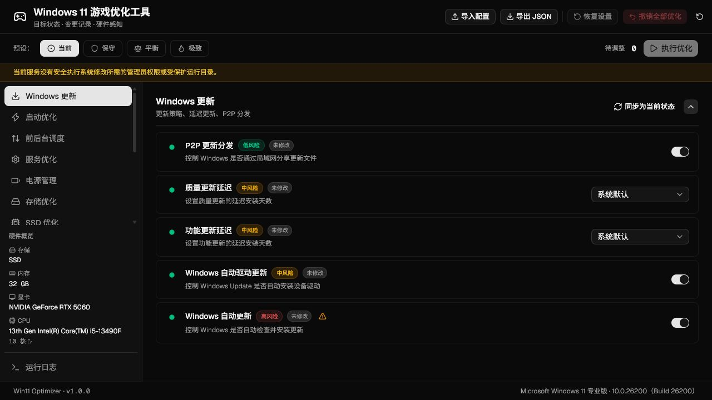

<div align="center">

# Win11 Optimizer

**读取当前状态、规划目标差异并保留可恢复记录的 Windows 11 游戏优化工具。**

[快速开始](#快速开始) · [工作方式](#工作方式) · [功能范围](#功能范围) ·
[安全与恢复](#安全与恢复) · [开发与构建](#开发与构建)

</div>

---

Win11 Optimizer 是一个由 Electron 桌面界面、本地 Node.js 服务和 Windows
PowerShell 5.1 执行引擎组成的控制面板。它会先读取硬件与系统状态，再比较目标配置，
只执行已确认且可验证的差异，并为实际变更建立备份和持久化记录。

当前版本为 `Dev 0.0.1`。项目不承诺固定的 FPS 或延迟提升；不同硬件、驱动和 Windows
版本得到的结果可能不同。

<p align="center">
  
</p>

> [!IMPORTANT]
> `Launch.bat` 是源码预览入口，预览模式永久禁用系统修改。只有打包后的应用在
> Windows 11 客户端、管理员权限和受保护运行目录均通过检查时，才会启用优化、
> 恢复和撤销操作。

## 快速开始

### 运行打包版

系统要求：

- Windows 11 客户端，Build `22000` 或更高版本，不支持 Windows Server
- x64 处理器
- Windows PowerShell 5.1
- 管理员权限

从 [GitHub Releases](https://github.com/AkiraNyx/Win11-Gaming-Optimizer/releases)
下载所需版本的 `Win11Optimizer.exe`，然后直接运行。

应用会请求管理员权限。启动后等待系统状态读取完成，再选择预设或调整单项设置。

### 安全预览源码

开发预览需要 Node.js `22.12.0` 或更高版本和 npm：

```powershell
.\Launch.bat
```

脚本会在缺少依赖时运行 `npm ci`，构建当前 UI，并在
`http://127.0.0.1:3108` 启动本地预览。该模式可以读取状态和测试界面，但不会执行
系统修改。

## 工作方式

1. **读取环境**：启动界面显示服务加载进度，随后检查 Windows 版本、管理员权限、
   运行目录、硬件以及 84 个配置/诊断项目的状态。
2. **确定目标**：选择“当前”“保守”“平衡”或“极致”，也可以逐项调整。“当前”
   代表已读取到的实时状态；手动修改后界面显示“已自定义”。
3. **检查差异**：侧栏显示各分类的待调整数量。未知状态、硬件限制、依赖冲突或没有
   实际差异时，执行按钮保持不可用。
4. **确认风险**：中高风险转换需要二次确认。一次性命令不会随预设自动启用。
5. **应用并验证**：执行引擎重新读取状态、生成计划、创建备份和变更日志，然后按分类
   应用目标并核验结果。
6. **恢复或重试**：可以恢复最近一次优化、使用本工具创建的系统还原点，或按时间逆序
   撤销全部尚未恢复的优化记录。

快速启动依赖休眠。快速启动处于目标启用状态时，界面会阻止关闭休眠，并在对应控件
附近说明原因。

## 功能范围

项目定义了 14 个分类、84 个项目：72 个可比较的目标设置、5 个由用户明确选择的
一次性命令，以及 7 个只读诊断项。

| 分类 | 当前实现 |
| --- | --- |
| Windows 更新 | P2P 分发、质量/功能更新延迟、驱动更新和自动更新策略 |
| 启动优化 | 快速启动、休眠依赖、启动日志、启动菜单超时、启动声音和处理器限制清理 |
| 前后台调度 | 游戏模式、前台调度、后台应用和 Game DVR |
| 服务优化 | 遥测、传真、远程注册表、SysMain、搜索、Xbox、打印、蓝牙等 13 个服务的启动类型 |
| 电源管理 | 独立游戏电源方案、处理器状态、节流、USB、PCIe、磁盘超时和 Boost |
| 存储优化 | NTFS 时间戳、8.3 名称、页面文件和休眠；搜索索引与 USN 日志为只读诊断 |
| SSD 优化 | TRIM、Prefetch/SysMain；计划优化、写入缓存和 AHCI 为只读诊断 |
| 内存优化 | 内存压缩、崩溃转储和系统缓存 |
| CPU 优化 | 计时器策略、核心停放，以及移除强制平台时钟设置的一次性命令 |
| GPU 优化 | 硬件 GPU 调度、全屏优化、GPU 优先级、Aero Peek，以及显式 NVIDIA/AMD 配置命令 |
| 网络优化 | Nagle、网络节流、预留带宽、DNS、网卡节能；TCP 栈与 Delivery Optimization 为只读诊断 |
| 界面优化 | 透明、动画、阴影、Snap Assist、Widgets、Copilot、通知中心和视觉模式 |
| 隐私优化 | 诊断数据、广告 ID、活动历史、位置、建议和 Cortana 等策略 |
| 安全优化 | Defender 空闲扫描、DEP、CPU 漏洞缓解和显式游戏目录排除命令 |

部分选项会受硬件或当前状态限制。例如，检测到实体打印机或蓝牙硬件时，服务模块会
拒绝禁用对应服务；关闭内存压缩要求至少检测到 16 GB 内存。

## 配置与预设

- 三套内置目标预设位于 `config\presets`：`conservative`、`balanced` 和
  `extreme`。
- 配置格式使用 JSON Schema draft-07，当前 schema 版本为 `2.0`。
- 导入文件最大为 1 MB。v2 配置会严格校验必需字段、枚举和额外字段。
- v1 配置只有在实时系统状态可用时才能迁移，并会先展示差异。
- 导出内容包含目标配置、导出时间和已知硬件摘要，不包含系统状态或恢复记录。
- 未执行的界面调整不会自动持久化；需要跨会话保留时，请显式导出 JSON。

“当前”是界面中的实时状态视图，不是 JSON schema 内的独立预设值。导出的当前目标会
按自定义配置保存。

## 安全与恢复

### 执行前

- UI 和 PowerShell 两层都会校验配置。
- 任一必需目标状态未知、不可验证或被硬件约束阻止时，整次优化不会开始。
- 本地服务只监听 `127.0.0.1`，API 校验 Host、Origin 和随机会话令牌。
- 同一时间只允许一个系统操作；PowerShell 还使用全局互斥锁阻止跨进程并发写入。
- 打包版会将脚本提取到受保护目录，并使用 SHA-256 清单验证脚本完整性。

### 应用期间

- 每次实际优化前必须成功创建文件备份，否则不会继续。
- 程序会尝试创建 Windows 系统还原点。Windows 的创建频率限制可能使本次还原点被
  跳过，此时文件备份和变更日志仍然保留。
- 每一项变更会先以 `Pending` 状态原子写入变更日志，再执行系统命令。
- 应用结束后会重新读取目标状态。部分失败会明确报告为失败，不会显示为完全成功。

### 恢复语义

- **恢复最近一次优化前设置**：恢复最近一份仍有未恢复项目的变更记录。
- **使用系统还原点**：启动由本工具记录的 Windows 系统还原点恢复。
- **撤销全部优化**：从最新记录开始，逆序恢复所有尚未恢复的优化会话。

“撤销全部优化”不会删除 EXE、日志、备份或数据目录，也不是恢复 Windows 出厂默认值。
恢复在首个失败项处停止，已成功恢复的记录会立即标记，剩余项目可再次重试。

> [!WARNING]
> 优化部分失败时不会自动回滚。请查看运行日志，并使用保留的变更记录执行恢复。

## 数据与日志

打包版将运行数据保存在：

```text
%ProgramData%\Win11Optimizer
```

其中包括：

- `optimization_*.log`：优化过程日志
- `changes_*.json`：可重试的变更记录
- `backup_*\backup_manifest.json`：应用前文件备份清单
- `config_*.json`：提交执行的配置
- `pre_optimize_*.json`：界面保存的执行前快照
- `runtime\scripts-*`：校验后的打包脚本副本

源码预览默认使用 `config\output`，但预览模式不会写入系统设置。

## 开发与构建

### 安装依赖

```powershell
cd .\ui
npm.cmd ci
```

完整源码预览应从项目根目录运行 `Launch.bat`。`npm run dev` 只启动 Next.js 前端，
不包含本项目的本地 API 服务，因此不应作为完整功能入口。

### 质量检查

```powershell
cd .\ui
npm.cmd test
npm.cmd run lint
npx.cmd tsc --noEmit --incremental false
```

PowerShell 恢复逻辑的专项回归测试从项目根目录运行：

```powershell
powershell.exe -NoProfile -ExecutionPolicy Bypass `
  -File .\tests\RestoreRetry.Tests.ps1
```

测试覆盖配置依赖、预设状态、服务端安全边界、Electron 启动流程和恢复重试逻辑。
当前仓库没有在真实 Windows 设置上执行完整优化与恢复的自动化集成测试。

### 构建单文件应用

```powershell
.\Build.bat
```

构建脚本会校验 schema 与预设副本，运行测试、ESLint 和 TypeScript 检查，生成 Next.js
静态界面，再通过 Electron Builder 创建 Windows x64 便携应用。所有步骤通过后，产物为：

```text
dist\Win11Optimizer.exe
```

当前打包配置未包含 Authenticode 代码签名。自行构建的 EXE 可能被 Windows 标记为
“未知发布者”。

## 项目结构

```text
.
├── assets/                 # README 等项目图片
├── config/
│   ├── presets/            # 保守、平衡、极致预设
│   └── schema.json         # v2.0 配置 schema
├── scripts/
│   ├── modules/            # 14 个状态读取与优化模块
│   ├── utils/              # 日志、备份、注册表、服务和原生命令工具
│   ├── main.ps1            # 计划、备份、应用和验证入口
│   ├── restore.ps1         # 单次恢复与系统还原入口
│   └── uninstall.ps1       # 逆序撤销全部优化记录
├── tests/                  # PowerShell 恢复回归测试
├── ui/
│   ├── electron/           # Electron 主进程、预加载脚本和启动界面
│   ├── src/                # Next.js 页面、组件、hooks、类型和配置逻辑
│   ├── public/             # 构建时使用的 schema 与预设副本
│   └── server.js           # 回环 HTTP 服务、API 和 PowerShell 进程管理
├── Build.bat               # 完整检查与单文件打包
├── Launch.bat              # 安全源码预览入口
└── Start.bat               # 预览构建和本地服务启动脚本
```

## 已知边界

- 状态未知会阻止执行，不会猜测或强制套用目标值。
- 7 个诊断项只展示信息，不会作为可修改目标执行。
- 部分 BCD、电源、页面文件和策略变更需要重启；应用只会建议或由用户明确安排重启。
- 完整备份恢复的范围可能大于单次变更日志，可能覆盖备份后在相同注册表或服务范围内
  发生的其他修改。
- 项目没有提供可复现的 FPS、帧时间或输入延迟基准。

## 许可

Copyright (C) 2026 AkiraNyx

本项目采用 [GNU Affero General Public License v3.0](./LICENSE) 许可，许可证标识为
`AGPL-3.0-only`。

---

<div align="center">

**先读状态，再改差异；每次实际变更都留下恢复依据。**

</div>
