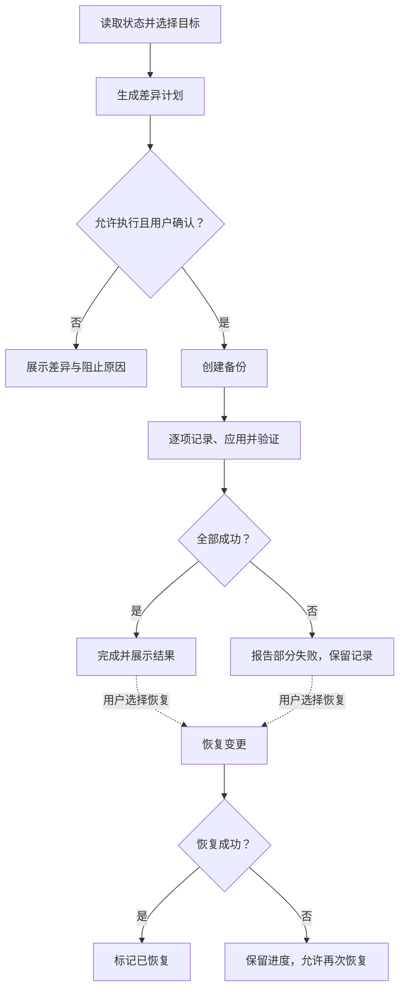

<div align="center">


# Win11 Optimizer

**为 Windows 11 游戏玩家读取系统状态、规划目标差异，并保留可恢复记录。**

[](https://github.com/AkiraNyx/Win11-Gaming-Optimizer/actions/workflows/build-exe.yml)
[Dev 0.0.3](https://github.com/AkiraNyx/Win11-Gaming-Optimizer/releases/tag/v0.0.3) · Windows 11 x64 · [AGPL-3.0-only](./LICENSE)

[快速开始](#快速开始) · [功能与工作方式](#功能与工作方式) · [安全与恢复](#安全与恢复) · [开发与构建](#开发与构建)

</div>

通过 Electron 界面选择目标，由 Node.js 本地服务协调 PowerShell 执行引擎：执行前比较状态、创建备份，执行后重新读取并验证结果。

<p align="center">
  
</p>

从分类导航查看设置，选择预设后检查待调整项目及阻止原因，再确认执行。

- **状态与差异**：读取 84 个项目，仅将可验证的差异纳入执行计划。
- **目标与依赖**：提供保守、平衡、极致和自定义目标，检查硬件条件与配置依赖。
- **备份与验证**：先保存备份和变更记录，再应用设置并检查结果。
- **恢复与重试**：保留恢复进度，支持单次恢复和逆序撤销全部未恢复记录。

<p align="center">
   Electron ·
   Next.js ·
   Node.js ·
   PowerShell
</p>

## 快速开始

### 使用发布版

环境：**Windows 11 客户端 Build 22000+、x64、Windows PowerShell 5.1、管理员权限**。Windows Server 不在支持范围内。

1. 从 [Releases](https://github.com/AkiraNyx/Win11-Gaming-Optimizer/releases) 下载便携版 `Win11Optimizer.exe`，运行并允许 UAC 管理员权限。
2. 等待状态读取完成，选择预设或调整自定义目标。
3. 检查差异、风险和备份说明，确认后执行。
4. 查看验证结果；部分 BCD、电源、页面文件和策略设置需要重启后完全生效。

> [!IMPORTANT]
> 系统修改要求打包运行时、管理员权限、受支持系统及受保护运行目录检查通过。当前 EXE 未签署 Authenticode，下载后请核对发布来源与提供的哈希。

### 源码预览

环境：Windows、Git、Node.js 22 和 npm；仓库 CI 使用 Node.js 22。在 PowerShell 中运行：

```powershell
git clone https://github.com/AkiraNyx/Win11-Gaming-Optimizer.git
cd .\Win11-Gaming-Optimizer
.\Launch.bat
```

脚本在缺少 `ui\node_modules` 时安装依赖，再构建 UI。打开 `http://127.0.0.1:3108`，等待界面显示当前状态即可开始预览；保持终端运行，按 `Ctrl+C` 结束。

**源码预览模式始终禁用系统修改功能**，可用于查看状态、预设和目标差异。

## 功能与工作方式

当前包含 **14 类、84 项：72 个可比较目标、5 个显式选择的一次性命令、7 个只读诊断项**。一次性命令不会随预设自动启用，诊断项不会作为写入操作执行。



未知、不可验证、硬件限制或依赖冲突会阻止执行。快速启动依赖休眠；检测到打印机或蓝牙设备时会拒绝禁用对应服务，关闭内存压缩要求至少 16 GB 内存。

<details>
<summary>查看全部 14 类功能</summary>

| 类别 | 覆盖内容 |
| --- | --- |
| Windows 更新 | P2P 传递、质量/功能更新延迟、驱动更新、自动更新 |
| 启动优化 | 快速启动、休眠依赖、启动日志、启动菜单超时、启动声音、处理器限制清理 |
| 前后台调度 | Game Mode、前台调度、后台应用、Game DVR |
| 服务优化 | 遥测、Fax、Remote Registry、SysMain、搜索、Xbox、打印、蓝牙等服务启动类型 |
| 电源管理 | 独立游戏电源方案、处理器状态、节流、USB、PCIe、磁盘超时、Boost |
| 存储优化 | NTFS 时间戳、8.3 文件名、页面文件、休眠；搜索索引和 USN 为只读诊断 |
| SSD | TRIM、Prefetch/SysMain；计划优化、写入缓存、AHCI 为只读诊断 |
| 内存 | 内存压缩、崩溃转储、系统缓存 |
| CPU | 定时器、核心停放、移除强制平台时钟的一次性命令 |
| GPU | 硬件 GPU 调度、全屏优化、GPU 优先级、Aero Peek，以及 NVIDIA/AMD 入口 |
| 网络 | Nagle、网络节流、保留带宽、DNS、网卡节能；TCP 栈和 Delivery Optimization 为只读诊断 |
| UI | 透明效果、动画、阴影、Snap Assist、Widgets、Copilot、通知中心、视觉模式 |
| 隐私 | 诊断数据、广告 ID、活动历史、位置、建议、Cortana 策略 |
| 安全 | Defender 空闲扫描、DEP、CPU 缓解策略、明确指定的游戏目录排除项 |


</details>

### 预设与配置

选择保守、平衡、极致或自定义目标；“当前”表示实时状态，不是独立预设。界面调整不会跨会话保留，需要保存时请导出 JSON。导出包含目标配置、导出时间和已知硬件摘要，不包含系统状态或恢复记录。

<details>
<summary>配置格式、导入限制与旧版本迁移</summary>

- 内置预设位于 [config/presets](./config/presets)：`conservative.json`、`balanced.json`、`extreme.json`。
- [配置 Schema](./config/schema.json) 使用 JSON Schema Draft-07，配置版本为 `2.0`；预设值为 `conservative`、`balanced`、`extreme`、`custom`。
- 导入文件最大 1 MB；v2 严格检查必填字段、枚举及额外字段。
- v1 配置只有在实时状态可用时才可迁移，迁移后展示差异。
- “当前”目标导出时按自定义配置保存。

</details>

## 安全与恢复

实际优化前必须成功创建文件备份，并在执行命令前原子写入待处理变更记录（journal）。程序会尝试创建系统还原点；Windows 创建频率限制可能使该步骤跳过，文件备份和变更记录仍用于恢复。

> [!WARNING]
> 部分失败不会自动回滚整次优化。请查看日志和变更清单，再主动选择恢复。完整备份恢复可能覆盖备份后在相同注册表或服务范围内发生的其他修改。

| 恢复方式 | 行为 |
| --- | --- |
| 恢复最近一次优化 | 处理最近一份仍有未恢复项目的变更记录 |
| 使用系统还原点 | 启动本工具记录的 Windows 系统还原流程 |
| 撤销全部优化 | 按最新到最旧顺序恢复全部未恢复会话 |

恢复遇到首个失败时停止，成功项会被标记，剩余项可重试。“撤销全部优化”不会删除 EXE、日志、备份或数据目录，也不等同于恢复出厂设置。

<details>
<summary>执行保护与按钮不可用的原因</summary>

- 配置经过多层校验；本地服务只监听 `127.0.0.1`，并检查 Host、Origin 和会话令牌。
- 同一时间只允许一个系统操作；全局互斥锁防止跨进程并发写入。
- 打包脚本提取到受保护目录，并经过 SHA-256 完整性检查。
- 状态读取未完成、运行时未就绪、权限或系统不满足要求、没有差异，以及未知/硬件/依赖阻止项，均可能使执行按钮不可用。界面会显示具体原因。

</details>

### 数据位置

打包版：`%ProgramData%\Win11Optimizer`；源码预览输出：`config\output`。请保留用于恢复的日志、备份与变更清单。

<details>
<summary>运行文件说明</summary>

| 文件 | 用途 |
| --- | --- |
| `optimization_*.log` | 优化与恢复日志 |
| `changes_*.json` | 可重试的变更清单 |
| `backup_*\backup_manifest.json` | 文件备份清单 |
| `config_*.json` | 执行配置快照 |
| `pre_optimize_*.json` | 优化前快照 |
| `runtime\scripts-*` | 已校验的打包脚本 |

</details>

项目未提供可复现的 FPS、帧时间或输入延迟基准；实际效果取决于硬件、驱动、系统版本和游戏，请在自己的环境中验证。

## 开发与构建

以下代码块均从**仓库根目录**在 PowerShell 中运行。开发环境使用 Node.js 22、npm 和 Windows PowerShell 5.1。

安装依赖：

```powershell
npm.cmd --prefix .\ui ci
```

完整预览使用 `.\Launch.bat`。`npm.cmd --prefix .\ui run dev` 只启动 Next.js 前端，不包含本地 API 服务。

质量检查：

```powershell
npm.cmd --prefix .\ui test
npm.cmd --prefix .\ui run lint
Push-Location .\ui
try { npx.cmd tsc --noEmit --incremental false } finally { Pop-Location }
```

Node 测试覆盖配置依赖、预设、服务端和 Electron 启动。PowerShell 回归测试单独运行：

```powershell
powershell.exe -NoProfile -ExecutionPolicy Bypass -File .\tests\BackupRegistry.Tests.ps1
powershell.exe -NoProfile -ExecutionPolicy Bypass -File .\tests\GpuOptimization.Tests.ps1
powershell.exe -NoProfile -ExecutionPolicy Bypass -File .\tests\PowerNetworkRegression.Tests.ps1
powershell.exe -NoProfile -ExecutionPolicy Bypass -File .\tests\RestoreRetry.Tests.ps1
```

这些测试覆盖部分回归路径，不等同于真实 Windows 硬件上的完整优化与恢复集成测试。

构建便携版：

```powershell
.\Build.bat
```

脚本校验 Schema 和预设副本，构建 UI，执行 Node/Electron 测试、ESLint 和 TypeScript 检查，再使用 Electron Builder 打包。成功后产物位于 `dist\Win11Optimizer.exe`。

<details>
<summary>项目结构</summary>

```text
.
├─ assets\                  # README 与项目资源
├─ config\                  # Schema、预设及运行输出目录
├─ scripts\                 # 优化、备份、恢复、卸载 PowerShell 模块
├─ tests\                   # PowerShell 回归测试
├─ ui\
│  ├─ electron\             # Electron 主进程与启动逻辑
│  ├─ public\               # 前端公开资源与 Schema 副本
│  ├─ src\                  # Next.js 界面
│  ├─ server.js              # 本地 Node.js 服务
│  └─ package.json           # UI、服务与打包脚本
├─ Build.bat                # 构建与产物校验
├─ Launch.bat               # 源码预览入口
├─ Start.bat                # 本地预览启动脚本
└─ LICENSE                  # AGPL-3.0-only 许可证
```

</details>

## 更多信息

[版本与下载](https://github.com/AkiraNyx/Win11-Gaming-Optimizer/releases) · [构建记录](https://github.com/AkiraNyx/Win11-Gaming-Optimizer/actions/workflows/build-exe.yml)

### Star History

<a href="https://www.star-history.com/?repos=akiranyx%2Fwin11-gaming-optimizer&amp;type=date&amp;legend=top-left">
  <picture>
    <source media="(prefers-color-scheme: dark)" srcset="https://api.star-history.com/chart?repos=akiranyx/win11-gaming-optimizer&amp;type=date&amp;theme=dark&amp;legend=top-left">
    <source media="(prefers-color-scheme: light)" srcset="https://api.star-history.com/chart?repos=akiranyx/win11-gaming-optimizer&amp;type=date&amp;legend=top-left">
    
  </picture>
</a>

由 AkiraNyx 维护，采用 [AGPL-3.0-only](./LICENSE) 许可证。视觉组件使用 [Capsule Render](https://github.com/kyechan99/capsule-render) 与 [Devicon](https://github.com/devicons/devicon)；远程图片不可用时，正文、命令和本地截图仍可阅读。
